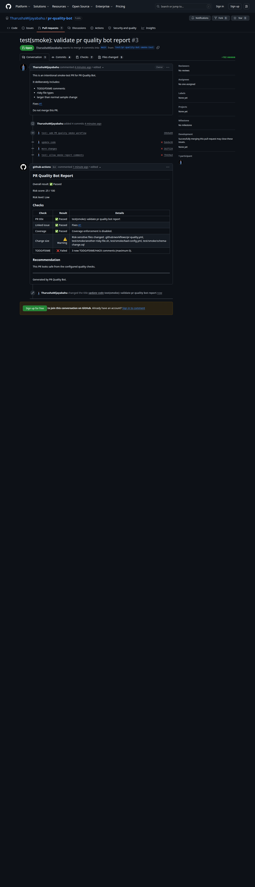

# PR Quality Bot

[](https://github.com/TharushaWijayabahu/pr-quality-bot/actions/workflows/ci.yml)
[](https://github.com/TharushaWijayabahu/pr-quality-bot/actions/workflows/codeql.yml)
[](LICENSE)

A configurable GitHub Action that reviews pull requests, calculates a quality risk score, and posts a clear automated PR comment.

PR review standards are often documented but applied inconsistently. PR Quality Bot turns common checks into fast, visible feedback without a hosted service, database, or source-code upload. It runs entirely in GitHub Actions using the repository's token and checked-out files.

## Features

- Validates Conventional Commit-style PR titles.
- Requires issue references in the title or body.
- Reads line coverage from LCOV, JaCoCo XML, or Cobertura XML.
- Flags large changes, large local files, and risk-sensitive file types.
- Checks only added PR patch lines for `TODO`, `FIXME`, and `HACK` markers.
- Produces a configurable 0–100 risk score and pass/fail policy.
- Creates or updates one readable PR timeline comment.
- Generates grouped changelog entries from merged pull requests.
- Exposes machine-readable outputs for later workflow steps.

## Quick start

Create `.github/workflows/pr-quality.yml`:

```yaml
name: PR Quality Bot

on:
  pull_request:
    types: [opened, synchronize, reopened, edited]

permissions:
  contents: read
  pull-requests: read
  issues: write

jobs:
  pr-quality:
    runs-on: ubuntu-latest
    steps:
      - uses: actions/checkout@9c091bb21b7c1c1d1991bb908d89e4e9dddfe3e0 # v7.0.0

      - name: Run PR Quality Bot
        uses: TharushaWijayabahu/pr-quality-bot@v1
        with:
          github-token: ${{ secrets.GITHUB_TOKEN }}
          min-coverage: '80'
          fail-on-risk: high
```

Checkout is required for coverage reports and local file-size checks. PR metadata and patches come from the GitHub API.

## Configuration file

The default path is `.github/pr-quality-bot.yml`. Copy [the complete example](examples/pr-quality-bot.yml), or start with:

```yaml
title:
  regex: '^(feat|fix|docs|refactor|test|chore)(?:\([a-zA-Z0-9._-]{1,64}\)|): .{10,256}$'

linkedIssue:
  required: true
  regex: '(close[sd]?|fix(e[sd])?|resolve[sd]?)\s+#\d+|#[0-9]+|[A-Z]{2,10}-\d+'

coverage:
  min: 80
  paths:
    - coverage/lcov.info
    - target/site/jacoco/jacoco.xml

changeSize:
  maxFilesChanged: 25
  maxAdditions: 500
  maxDeletions: 300
  largeFileThresholdKb: 500

todo:
  max: 0
  keywords: [TODO, FIXME, HACK]

risk:
  failOn: high
  weights:
    title: 15
    linkedIssue: 15
    coverage: 25
    changeSize: 25
    todo: 20

comment:
  enabled: true
```

Non-default workflow inputs override the corresponding configuration-file values. Invalid regexes, thresholds, arrays, and risk levels produce a concise action error.

## Inputs

| Input                     | Default                            | Description                                       |
| ------------------------- | ---------------------------------- | ------------------------------------------------- |
| `github-token`            | `${{ github.token }}`              | Token used to read PR data and post comments.     |
| `config-path`             | `.github/pr-quality-bot.yml`       | Optional YAML configuration path.                 |
| `title-regex`             | Conventional Commit pattern        | PR title validation regex.                        |
| `require-linked-issue`    | `true`                             | Require an issue reference in title or body.      |
| `linked-issue-regex`      | GitHub/Jira-style pattern          | Issue reference regex.                            |
| `coverage-report-paths`   | Common LCOV/JaCoCo/Cobertura paths | Comma-separated paths, checked in order.          |
| `min-coverage`            | `80`                               | Required line coverage; `0` disables enforcement. |
| `max-files-changed`       | `25`                               | Changed-file warning threshold.                   |
| `max-additions`           | `500`                              | Addition warning threshold.                       |
| `max-deletions`           | `300`                              | Deletion warning threshold.                       |
| `large-file-threshold-kb` | `500`                              | Local changed-file size threshold.                |
| `todo-fixme-max`          | `0`                                | Allowed markers in added patch lines.             |
| `fail-on-risk`            | `high`                             | Failure threshold: `none`, `medium`, or `high`.   |
| `post-comment`            | `true`                             | Create or update the PR report comment.           |
| `comment-marker`          | `<!-- pr-quality-bot-comment -->`  | Marker used to locate an existing comment.        |

## Outputs

| Output         | Description                                                      |
| -------------- | ---------------------------------------------------------------- |
| `risk-score`   | Numeric risk score from 0 to 100.                                |
| `risk-level`   | `low`, `medium`, or `high`.                                      |
| `passed`       | Whether the score remains below `fail-on-risk`.                  |
| `summary-json` | JSON containing every analyzer result and the final risk result. |

Use an output by assigning an `id` to the action step:

```yaml
- id: quality
  uses: TharushaWijayabahu/pr-quality-bot@v1
- run: echo "Risk is ${{ steps.quality.outputs.risk-level }}"
```

## Risk scoring

Default failed-check weights are title `15`, linked issue `15`, coverage `25`, change size up to `25`, and TODO/FIXME `20`. Change-size points increase with the number of triggered categories: file count, additions, deletions, sensitive types, and large files. Scores are capped at 100.

|  Score | Level  | Default action behavior       |
| -----: | ------ | ----------------------------- |
|   0–29 | Low    | Pass                          |
|  30–69 | Medium | Pass with attention requested |
| 70–100 | High   | Fail                          |

`fail-on-risk` changes the action failure threshold without changing the score or level. A missing or unreadable coverage report is a warning with zero risk points rather than a crash.

## Sample comment

> ## PR Quality Bot Report
>
> Overall result: ⚠️ Needs attention
>
> Risk score: 42 / 100
>
> Risk level: Medium
>
> | Check    |     Result | Details                                |
> | -------- | ---------: | -------------------------------------- |
> | PR title |  ✅ Passed | feat(auth): add refresh token rotation |
> | Coverage | ⚠️ Warning | 76.5%, required 80%                    |

The hidden marker lets each run update the same timeline comment instead of adding noise.

## Demo

See the real [PR Quality Bot smoke-test pull request](https://github.com/TharushaWijayabahu/pr-quality-bot/pull/3) and the [validation checklist](docs/assets/smoke-test-result.md).



## Changelog generation

Run the **Generate changelog** workflow manually and download its artifact, or run locally with `GITHUB_TOKEN`, `GITHUB_REPOSITORY`, and optional `CHANGELOG_VERSION` set:

```bash
npm run changelog
```

Merged PRs since the latest Git tag are grouped into Features, Fixes, Documentation, Refactoring, Performance, Tests, Maintenance, and Other sections. Each entry includes its PR number and author.

## Security and permissions

The recommended permissions are `contents: read`, `pull-requests: read`, and `issues: write`. The last permission is needed for timeline comments; if it is unavailable, analysis, logs, and outputs still work.

For public repositories receiving fork PRs, this action may not be able to post comments on every forked PR depending on repository permissions. It should still produce logs and outputs. Do not use `pull_request_target` with untrusted code checkout unless the workflow is carefully hardened.

Treat coverage files and checked-out PR code as untrusted. PR Quality Bot parses reports locally and never executes changed code. Configuration and report paths are constrained to the workspace, symlink escapes and XML entity declarations are rejected, report sizes are bounded, and configurable regular expressions are checked for unsafe backtracking. Pin the action to a release tag or full commit SHA according to your dependency policy. See [SECURITY.md](SECURITY.md) for reporting vulnerabilities.

## Development

Node.js 22 or newer is required.

```bash
npm ci
npm run all
```

`npm run build` type-checks the project and packages `src/index.ts` into the committed `dist/index.js`. Action-source changes must include the rebuilt `dist` output.

## Roadmap

- Configurable path allow/deny policies.
- Baseline-aware coverage regression checks.
- Optional labels derived from risk level.
- More coverage report formats and monorepo aggregation.

Contributions are welcome. Read [CONTRIBUTING.md](CONTRIBUTING.md) and the [Code of Conduct](CODE_OF_CONDUCT.md) before opening a change.

## License

Licensed under the [MIT License](LICENSE).
